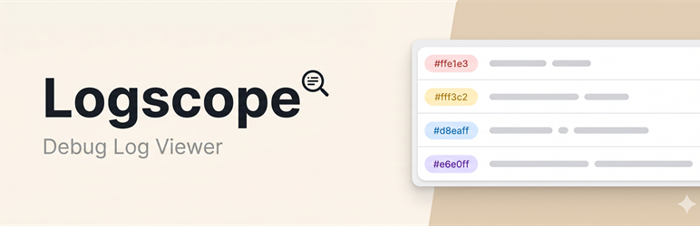
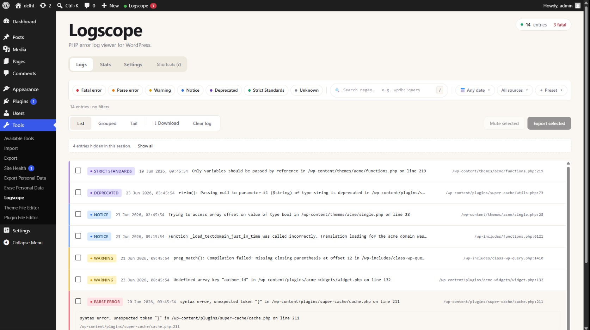
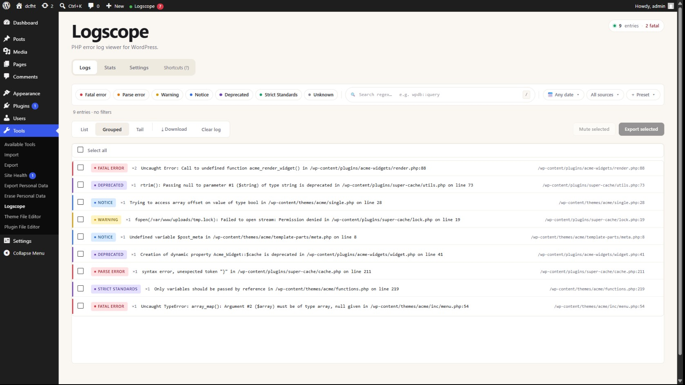
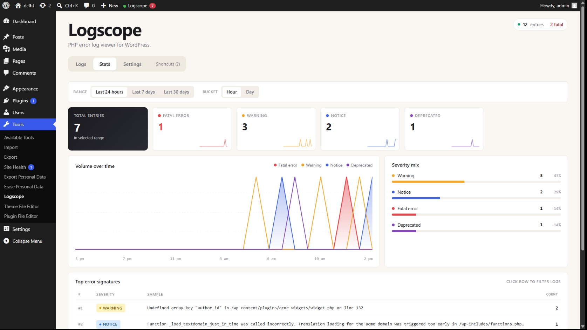
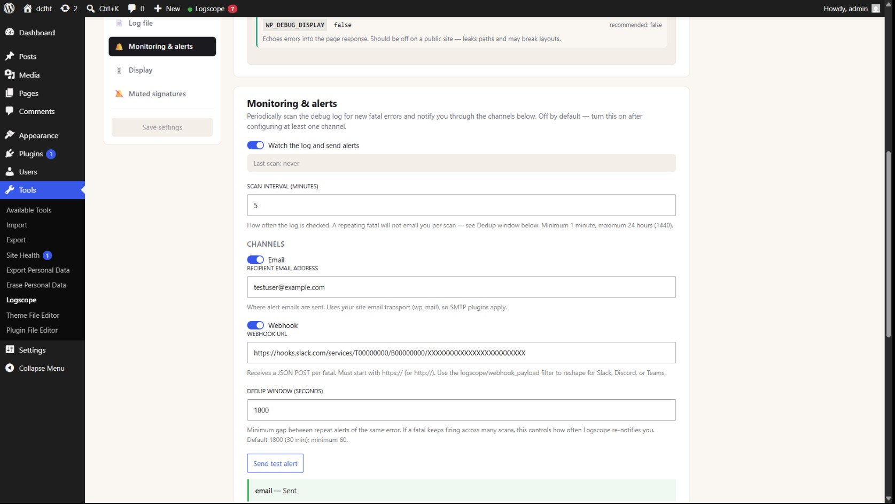

  

<h1 align="center">Logscope — Debug Log Viewer</h1>

  <strong>View, filter, group, and get alerts on your WordPress debug log — without leaving wp-admin.</strong>

  
  
  
  
  

---

Logscope turns `wp-content/debug.log` into a real admin tool. Instead of SSHing in to `tail -f` a file, you open **Tools → Logscope** and get a virtualized viewer that handles thousands of lines, severity and regex filters, error grouping by signature, stack-trace expansion, a live tail, and alerts for new fatals over email or webhook.

> **Free forever.** No paid tier, no telemetry, no upsells.

## Screenshots

|                                                           Log viewer                                                           |                                           Grouped view + bulk actions                                            |
| :----------------------------------------------------------------------------------------------------------------------------: | :--------------------------------------------------------------------------------------------------------------: |
|                 |          |
|                                                      **Stats dashboard**                                                       |                                               **Alerts settings**                                                |
|  |  |

## Features

-   **Log viewer** — virtualized list (10k+ lines without lag) with severity pills, timestamp, `file:line`, message, and stack-trace expansion for fatals.
-   **Filters** — severity multi-select, debounced server-side regex search, date range, and a source dropdown (plugins / themes / mu-plugins / core). Filter state is mirrored to the URL.
-   **Grouped view** — collapses duplicate errors by signature (`file:line` + normalised message), showing count and first/last seen. Multi-select rows to mute or export the selection to CSV in one batch.
-   **Tail mode** — toolbar toggle that polls for new entries. Detects log rotation; shows an "N new entries" pill when you've scrolled away.
-   **Stats dashboard** — severity breakdown bar, per-severity sparklines over 24h / 7d / 30d, and a top-10 signatures table with click-through to a pre-filtered Logs view.
-   **Alerts** — email and/or generic webhook on new fatals, with per-dispatcher dedup and a "Send test alert" button to verify wiring.
-   **Scheduled scanner** — opt-in WP-Cron job (1–1440 min) that reads new bytes since the last tick, filters to fatal/parse, groups, and feeds the alert pipeline.
-   **Retention / rotation** — opt-in daily archive of `debug.log` once it crosses a configurable size, pruning oldest archives beyond a cap.
-   **Mute** — silence known-and-accepted signatures so they stop dominating the viewer; unmute from Settings.
-   **Admin surfacing** — admin-bar status indicator, a "Recent errors" Dashboard widget, and a Tools → Site Health test for recent PHP errors.
-   **Built right** — REST-first architecture (`/wp-json/logscope/v1/*`), a React admin UI, and a `logscope_manage` capability gate on every route.

## Installation

1. Download the latest release zip from the [Releases](https://github.com/waqarahmadweb/logscope/releases) page (or, once published, install **Logscope** from the WordPress plugin directory).
2. In wp-admin: **Plugins → Add New → Upload Plugin**, choose the zip, and activate.
3. Open **Tools → Logscope**. If `WP_DEBUG_LOG` is off, the onboarding banner walks you through enabling it.

**Requirements:** WordPress **6.2+** · PHP **8.0+**

## Privacy

Logscope reads your debug log and sends **nothing** anywhere by default — no telemetry, no third-party calls. The only outbound traffic is the alerts subsystem, and only when you explicitly enable email or webhook alerts. See the [`readme.txt`](readme.txt) Privacy section for the full breakdown.

## Development

-   **[AGENTS.md](AGENTS.md)** — primary source of truth: conventions, naming, security rules, workflow.
-   **[CLAUDE.md](CLAUDE.md)** — Claude Code-specific operational notes.
-   **[ROADMAP.md](ROADMAP.md)** — phased plan from scaffold → v1.0.0 (wp.org) → beyond.
-   **[CHANGELOG.md](CHANGELOG.md)** — versioned history.
-   **[docs/spec.md](docs/spec.md)** — long-form technical specification.

## License

[GPL v2 or later](LICENSE). © Waqar Ahmad.
